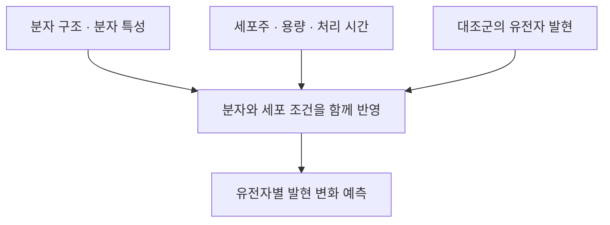

# Mol2Expr 모델 설명

[프로젝트 소개](README.md) · [핵심 코드](model_sketch.py)

분자 구조와 세포 조건이 어떻게 유전자 발현 예측으로 이어지는지 정리했습니다. 현재는 각 정보가 모델에서 어떤 역할을 하는지 공부하면서 구조를 살펴보고 있습니다.

## 입력부터 예측까지

### 분자 구조를 표현하기

약물의 원자와 결합 정보를 모델이 사용할 수 있는 숫자로 바꿉니다. 앞선 실험에서는 분자 구조를 고정된 길이의 숫자로 표현하는 Morgan 분자 지문을 사용했습니다. 이후에는 원자와 결합을 그래프로 표현하고, 연결된 원자들의 정보를 모으는 방식으로 확장해 보고 있습니다. 분자량 같은 물리화학적 특성도 함께 사용합니다.

### 세포와 처리 조건을 함께 반영하기

같은 약물도 어떤 세포에, 어느 정도의 용량으로, 얼마나 오래 처리했는지에 따라 반응이 달라질 수 있습니다. 그래서 세포주와 용량, 처리 시간, 약물을 처리하지 않은 대조군의 발현 정보를 함께 사용합니다.

현재 코드에는 용량에 따라 분자 특징의 크기를 조절하고, 세포 조건에 따라 특징을 다시 조절하는 부분이 있습니다. 어떤 정보가 예측에 도움이 되는지 알아보려면 이런 구성을 하나씩 비교해 볼 필요가 있습니다.

### 유전자별 변화로 바꾸기

예측하려는 값은 약물을 처리한 세포와 대조군 사이의 발현 차이입니다. 현재 모델은 같은 조건에서 나타나는 평균 반응을 기준으로 약물별 차이를 학습하고, 이를 유전자별 발현 변화로 바꿉니다.

코드에서는 분자, 실험 조건, 예측할 유전자를 각각 구분해 표현합니다. 문서와 코드에 나오는 P/C/R은 이 세 가지를 가리킵니다. 이 구조는 아직 검토 중이며, 앞선 분자 지문 모델의 점수가 현재 모델의 성능을 뜻하지는 않습니다.

## 참고하며 공부하는 자료

아래 자료를 모델의 각 부분과 연결해 살펴보고 있습니다. 구체적인 코드 구성은 프로젝트 과정에서 정한 선택이므로, 각 논문을 그대로 구현한 것으로 설명하지는 않습니다.

| 자료 | 살펴보는 내용 |
| --- | --- |
| [LPM](https://www.nature.com/articles/s43588-025-00870-1) | 분자·실험 조건·예측 대상을 구분해 표현하는 관점 |
| [chemCPA](https://proceedings.neurips.cc/paper_files/paper/2022/hash/aa933b5abc1be30baece1d230ec575a7-Abstract-Conference.html) | 분자 표현을 이용해 학습에서 보지 못한 약물의 반응을 예측하는 접근 |
| [Neural Message Passing for Quantum Chemistry](https://proceedings.mlr.press/v70/gilmer17a.html) | 연결된 원자 사이에서 정보를 주고받아 분자를 표현하는 방법 |
| [FiLM](https://arxiv.org/abs/1709.07871) | 조건에 따라 모델 내부 특징의 크기와 값을 조절하는 방법 |
| [RDKit 문서](https://rdkit.org/docs/GettingStartedInPython.html#morgan-fingerprints-circular-fingerprints) | 분자 지문과 물리화학적 특성을 코드로 다루는 방법 |

발현 데이터는 [SciPlex](https://pubmed.ncbi.nlm.nih.gov/31806696/)를 사용합니다. 유전자 이름과 화합물 구조의 연결, 발현 변화의 계산 기준을 정리하는 작업이 남아 있습니다.

[핵심 코드](model_sketch.py)에는 원자 정보의 결합, 용량과 세포 조건의 반영, 유전자별 출력 부분을 담았습니다. 전체 학습 과정보다는 모델의 흐름을 살펴볼 수 있도록 짧게 정리했습니다.

[프로젝트로 돌아가기](README.md)
