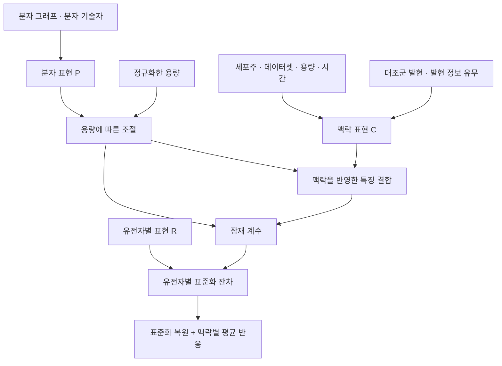

# 모델 구조와 계산식

[프로젝트 소개](README.md) · [핵심 코드](model_sketch.py)

현재 살펴보고 있는 P/C/R 후보의 `gated_factorized` 경로를 정리한 노트입니다. P는 분자, C는 처리 맥락, R은 예측할 유전자를 뜻합니다. 과거 분자 지문 모델의 점수가 이 그래프 기반 후보의 성능을 의미하지는 않습니다.

## 전체 흐름

이렇게 나누면 분자의 특성, 실험 조건, 예측할 항목이 각각 어디에서 들어가는지 살펴볼 수 있습니다. P/R/C를 나누는 관점의 선행연구는 [LPM](https://www.nature.com/articles/s43588-025-00870-1)이고, 구조 정보로 미관측 약물의 반응을 예측하는 관련 연구로는 [chemCPA](https://proceedings.neurips.cc/paper_files/paper/2022/hash/aa933b5abc1be30baece1d230ec575a7-Abstract-Conference.html)가 있습니다. 이 프로젝트에서는 분자 그래프와 대조군 정보를 입력으로 사용하는 후보를 구성하고 있습니다.

## 분자 구조를 표현하는 방법

앞선 실험에는 반지름 2의 Morgan 분자 지문과 RDKit 분자 기술자를 사용했습니다. 이후 후보에서는 원자와 결합을 그래프로 표현하고, 결합 종류별로 이웃 원자의 정보를 모으는 방식을 살펴보고 있습니다. 원자의 종류·전하·방향족 여부 등을 입력으로 사용합니다.

한 층의 계산은 다음과 같이 쓸 수 있습니다.

$$
m_i = W_0 h_i + \sum_b W_b\,\operatorname{mean}_{j\in N_b(i)} h_j
$$

$$
h_i' = \operatorname{LayerNorm}\left(h_i+f(m_i)\right)
$$

$h_i$는 원자 표현, $N_b(i)$는 결합 종류 $b$로 연결된 이웃입니다. 해당 종류의 이웃이 없으면 그 항은 0으로 둡니다. 실제 코드에서는 단일·이중·삼중·방향족 결합을 구분합니다. 여러 층을 거친 원자 표현의 평균과 최대값을 모아 분자 표현으로 바꾸고, 분자량 등 8개 기술자의 표현을 더합니다.

메시지 전달의 일반적인 배경은 [Gilmer 등, Neural Message Passing for Quantum Chemistry](https://proceedings.mlr.press/v70/gilmer17a.html), 분자 지문과 기술자 구현은 [RDKit 문서](https://rdkit.org/docs/GettingStartedInPython.html#morgan-fingerprints-circular-fingerprints)에서 확인할 수 있습니다. 위의 결합별 평균과 잔차 연결은 현재 후보 코드의 구성입니다. 코드의 `GraphMessageLayer`에 해당합니다.

## 용량과 세포 조건을 반영하는 방법

같은 분자라도 용량이 달라지면 반응이 달라질 수 있으므로, 분자 표현의 크기를 조절하는 게이트를 두었습니다.

$$
g=\sigma\left(s(P)\,[d-m(P)]\right),\qquad P_{\mathrm{eff}}=gP
$$

$d$는 $(\log_{10}(\text{용량 [M]})+6.5)/1.5$로 정규화한 용량입니다. 중간점 $m$은 `tanh`, 기울기 $s$는 `softplus`를 이용해 계산합니다. 로그 용량에 대한 단조 시그모이드 게이트를 적용한 설계 선택이며, 여기서 학습된 중간점을 실험으로 측정한 EC50로 해석하지는 않습니다. 최종 예측 전체의 단조성도 이 게이트만으로 보장되지 않습니다. 코드의 `dose_gate`에 해당합니다.

다음으로 맥락 표현에서 특징별 크기 조절값과 이동값을 계산합니다.

$$
H=P_{\mathrm{eff}}\odot\left(1+0.5\tanh(\gamma(C))\right)+\beta(C)
$$

이는 [FiLM](https://arxiv.org/abs/1709.07871)의 조건부 특징 조절 형태와 연결됩니다. `0.5 × tanh`로 크기 조절 범위를 제한한 부분은 현재 구현의 선택입니다. 시간과 대조군 정보는 맥락 표현을 통해 이 계산에 들어갑니다. 코드의 `condition_perturbation`에 해당합니다.

## 유전자별 예측으로 바꾸는 방법

분자 표현과 결합된 특징에서 잠재 계수 $z$를 만들고, 유전자별 표현 $R_j$와 결합합니다. 기존 후보 코드의 핵심 부분은 다음과 같습니다.

$$
z=D_P(P_{\mathrm{eff}})+D_I(\operatorname{Fusion}(H))
$$

$$
u_j=(zB)_j+\sigma(a)\frac{z\cdot R_j}{\sqrt{K}}
$$

$K$는 잠재 계수의 차원입니다. $B$는 학습 데이터에서 구한 반응 기저이며, 이 기저를 쓰지 않는 설정에서는 첫 항을 생략합니다. $a$는 학습되는 스칼라입니다. 유전자 표현은 학습 가능한 임베딩에 유전자 특징을 결합하는 경로를 사용합니다. 마지막으로 데이터셋별 스케일과 편향을 적용합니다. 이 부분이 코드의 `factorized_readout`입니다.

모델이 직접 학습하는 대상은 맥락별 평균 반응을 뺀 **표준화 잔차**입니다. 같은 조건의 평균 반응에서 약물별로 얼마나 달라지는지 학습하려는 구성입니다. 출력은 다음과 같이 되돌립니다.

$$
\widehat{\Delta y}=\widehat r\odot s_{\mathrm{train}}+\mu_{\mathrm{train}}+\overline{\Delta y}_{\mathrm{context}}
$$

여기서 $\widehat r$는 스케일과 편향까지 적용한 모델 출력입니다. 평균·척도·반응 기저·맥락별 평균을 구할 때는 학습 데이터만 사용해야 합니다. `restore_response`는 앙상블 보정을 적용하기 전의 복원 식입니다.

## 이 노트의 범위

[핵심 코드](model_sketch.py)는 기존 `prc_model.py`와 데이터 처리 코드에서 위 계산을 설명하는 부분만 뽑아 함수로 정리했습니다. 인코더 전체, 데이터 준비, 학습 반복 과정은 생략했습니다. 현재 후보를 이해하기 위한 발췌이며, 새로운 실험을 수행한 결과가 아닙니다.

데이터 출처는 [SciPlex 원 논문](https://pubmed.ncbi.nlm.nih.gov/31806696/)입니다. 현재는 유전자 주석과 화합물 구조 매핑을 다시 정리해야 하므로, 최종 유전자 목록과 모델의 일반화 성능은 아직 확정하지 않았습니다.

[프로젝트로 돌아가기](README.md)
