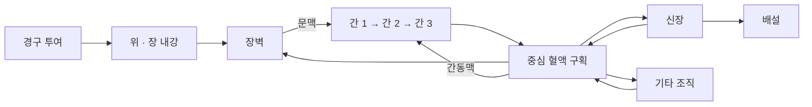

# 모델 구조와 계산식

[프로젝트 소개](README.md) · [핵심 코드](model_sketch.py)

기존의 분절형 PBPK 구현에서 장·간·신장의 대표 계산을 정리했습니다. 전체 인체를 세밀하게 구현하기보다, 약물이 들어오고 이동하고 제거되는 과정을 구획별로 이해하기 위한 노트입니다.

## 조직을 연결하는 방식

그림은 주요 이동 경로를 보여줍니다. 대사체의 별도 이동과 위장관의 세부 분절은 생략했습니다. 장·간·신장을 연결하는 PBPK의 일반적인 접근은 [Claassen 등의 에날라프릴 모델](https://www.frontiersin.org/journals/physiology/articles/10.3389/fphys.2013.00004/full)에서도 볼 수 있습니다. 이 프로젝트의 구획 구성과 식을 그 논문과 동일한 모델로 보지는 않습니다.

## 약물량에서 농도로

상태값은 각 구획의 약물량 $A_i$로 두고, 농도를 계산할 때 부피 $V_i$로 나눕니다. 시간은 h, 약물량은 mg, 부피는 L을 사용합니다.

$$
C_i=\frac{A_i}{V_i},\qquad C_i^{\mathrm{eq}}=\frac{A_i}{V_iK_{p,i}}
$$

$K_{p,i}$는 조직과 혈액 사이의 분배를 표현하는 무차원 계수입니다. $C_i$는 조직 농도, $C_i^{\mathrm{eq}}$는 혈류 이동 계산에 사용하는 혈액 등가 농도입니다. 둘을 구분해서 사용합니다.

기본 생각은 **약물량의 변화 = 들어온 양 − 나간 양 − 제거된 양**입니다. 신장이나 기타 조직처럼 하나의 혈류로 연결한 구획에서는 다음 형태가 됩니다.

$$
\frac{dA_i}{dt}=Q_i\left(C_{\mathrm{central}}-C_i^{\mathrm{eq}}\right)-v_i
$$

$Q_i$는 혈류량(L/h), $v_i$는 제거 속도(mg/h)입니다. 분배계수와 혈류를 이용하는 구획 모델의 일반적인 원리를 현재 구현에 맞춰 쓴 식입니다. 실제 조직을 균일한 구획으로 보는 가정이 들어갑니다.

## 장에서 흡수와 이동

현재 분절형 구현은 위의 고형 약물과 용해된 약물을 나누고, 장을 십이지장·공장·회장으로 구분합니다. 용출, 위 배출, 다음 장 구간으로의 이동에는 일차 속도식을 사용합니다.

한 장 구간의 내강 약물량을 $L_i$라고 하면:

$$
v_{\mathrm{abs},i}=f k_{a,i}L_i,\qquad
v_{\mathrm{transit},i}=k_{t,i}L_i
$$

$$
\frac{dL_i}{dt}=v_{\mathrm{in},i}-v_{\mathrm{abs},i}-v_{\mathrm{transit},i}
$$

흡수된 양은 장벽 구획으로 들어갑니다. 장벽에서는 중심 혈액과의 이동, 문맥으로의 유출, 대사를 함께 계산합니다. 코드의 `intestinal_segment`에 해당합니다.

여기서 $f$는 현재 코드에서 흡수 속도에 곱하는 계수입니다. 원래 변수명은 `fraction_absorbed`였지만, 각 장 구간의 속도를 조절하므로 실제 총 흡수율과는 다릅니다. 아래 발췌에서는 의미가 드러나도록 `absorption_scale`로 적었습니다. 장을 세 구간으로 나누고 일차 속도를 적용한 것도 단순화한 가정입니다.

## 간에서 포화되는 대사

간은 동일한 부피의 세 구간을 직렬로 연결합니다. 첫 구간에는 장에서 돌아온 문맥 혈류와 간동맥 혈류가 들어오고, 마지막 구간에서 중심 혈액으로 돌아갑니다.

대사에는 Michaelis–Menten 형태를 사용합니다.

$$
v_{\mathrm{met}}=\frac{V_{\max}C_u}{K_m+C_u},\qquad C_u=f_uC^{\mathrm{eq}}
$$

$V_{\max}$는 최대 대사 속도(mg/h), $K_m$은 농도 척도(mg/L), $f_u$는 비결합 분율입니다. 낮은 농도에서는 농도에 따라 속도가 증가하고, 높은 농도에서는 $V_{\max}$에 가까워지는 형태를 표현합니다. 식과 변수의 일반적인 의미는 [Open Systems Pharmacology의 Michaelis–Menten 설명](https://docs.open-systems-pharmacology.org/working-with-pk-sim/pk-sim-documentation/pk-sim-compounds-defining-inhibition-induction-processes)에 정리되어 있습니다.

코드의 `michaelis_menten`과 `liver_zones`에 해당합니다. 간을 세 구간으로 나누거나 구간별 활성 비율을 정한 것은 이 구현의 가정이며, 그 비율을 사람의 실제 간에서 측정했다는 의미는 아닙니다. 비결합 농도를 위와 같이 근사하는 방식과 매개변수의 단위도 약물별로 더 살펴봐야 합니다.

## 신장에서 제거

단순화한 신장 구획은 다음과 같이 계산합니다.

$$
v_{\mathrm{renal}}=CL_{\mathrm{app}} s_r C_{\mathrm{kidney}}^{\mathrm{eq}}
$$

$CL_{\mathrm{app}}$는 이 농도 정의에 대한 겉보기 청소율(L/h), $s_r$은 신장 기능과 체격에 따른 보정 계수입니다. 이 식에서는 청소율에 비결합 분율을 다시 곱하지 않습니다. 코드의 `kidney_compartment`에 해당합니다. 사구체 여과와 능동 분비를 각각 분리하는 후속 구현도 있으나, 이 발췌에서는 위 식까지만 보여줍니다.

## 계산식과 매개변수의 출처를 구분하기

일반적인 속도식을 사용하는 것과 특정 약물에 적절한 값을 넣는 것은 별개의 작업입니다. 현재는 기존 문헌의 값이 직접 측정값인지, 다른 모델에서 맞춘 값인지, 이 프로젝트에서 단순화한 가정인지 구분하며 살펴보고 있습니다.

| 자료 | 이 프로젝트와 연결되는 부분 |
| --- | --- |
| [Claassen 등, 2013](https://www.frontiersin.org/journals/physiology/articles/10.3389/fphys.2013.00004/full) | 에날라프릴·대사체의 PBPK 구성과 대사·배설 매개변수의 배경. 이 논문에 등장하는 일부 대사 상수는 사람에서 직접 측정한 값이 아니므로 그대로 옮길 수 있는지 추가 검토가 필요함 |
| [Open Systems Pharmacology 문서](https://docs.open-systems-pharmacology.org/working-with-pk-sim/pk-sim-documentation/pk-sim-compounds-defining-inhibition-induction-processes) | Michaelis–Menten 식과 비결합 기질 농도 등 계산식의 의미를 확인하는 자료 |
| [PK-DB 원 논문](https://academic.oup.com/nar/article/49/D1/D1358/5957165) | 사람 약동학 관측 자료를 정리한 데이터베이스. 비교 자료의 출처이며 모델 식 자체의 출처와 구분함 |

[핵심 코드](model_sketch.py)는 기존 `pbpk.py`와 `organs/pbpk_modules.py`의 계산을 짧게 정리한 것입니다. 구획별 양과 매개변수가 준비되었다고 가정하고, 전체 시간 적분과 투약 이벤트, 대사체의 양을 추적하는 코드는 생략했습니다. 구획별 계산을 설명하는 발췌입니다.

[프로젝트로 돌아가기](README.md)
