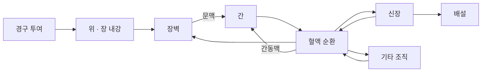

# TissuePK 모델 설명

[프로젝트 소개](README.md) · [핵심 코드](model_sketch.py)

약물이 몸에 들어온 뒤 여러 조직을 거쳐 이동하고 제거되는 과정을 표현해 보고 있습니다. 현재는 몸을 몇 개의 구획으로 단순화한 PBPK 모델을 바탕으로, 각 구획이 어떤 역할을 하는지 공부하고 있습니다.

## 조직을 연결하는 방식

그림은 주요 이동 경로를 보여줍니다. 현재 코드에서는 위장관과 간을 더 작은 구간으로 나누지만, 여기서는 전체 연결을 중심으로 정리했습니다.

### 장에서 흡수되기

먹은 약물이 위에서 용해되고 장으로 이동한 뒤, 일부가 장벽으로 흡수되는 과정을 계산합니다. 한 구간에서 흡수되지 않은 약물은 다음 구간으로 이동할 수 있습니다.

이 부분에서는 흡수 속도를 조절하는 값과 최종적으로 흡수되는 비율이 어떻게 다른지 살펴보고 있습니다. 공개한 코드에서는 속도를 조절하는 값에 `absorption_scale`이라는 이름을 사용했습니다.

### 혈류를 따라 조직 사이를 이동하기

각 구획에 들어 있는 약물량과 구획의 부피를 이용해 농도를 계산합니다. 조직으로 들어오고 나가는 혈류, 조직과 혈액 사이에 약물이 분포하는 정도를 반영해 구획별 약물량을 갱신합니다.

조직마다 약물이 균일하게 섞여 있다고 보는 등 단순화한 가정이 들어갑니다. 이런 가정이 실제 관측값과 얼마나 잘 맞는지도 살펴봐야 합니다.

### 간에서 대사되고 신장에서 제거되기

간에서는 약물이 대사되는 과정을, 신장에서는 몸 밖으로 제거되는 과정을 계산합니다. 간의 대사에는 농도가 높아질수록 대사 속도가 일정한 한계에 가까워지는 Michaelis–Menten 형태를 사용합니다. 신장에서는 청소율이라는 값으로 단위 시간에 제거되는 양을 계산합니다.

현재 공개한 코드는 이 과정의 일부를 단순화한 것입니다. 간의 구간별 역할이나 신장 제거 과정을 더 자세히 나누는 것이 언제 도움이 되는지는 계속 공부하고 있습니다.

## 참고하며 공부하는 자료

| 자료 | 살펴보는 내용 |
| --- | --- |
| [Claassen 등의 에날라프릴 PBPK 모델](https://www.frontiersin.org/journals/physiology/articles/10.3389/fphys.2013.00004/full) | 장·간·신장을 연결하는 방식과 대사·배설 매개변수의 배경 |
| [Open Systems Pharmacology 문서](https://docs.open-systems-pharmacology.org/working-with-pk-sim/pk-sim-documentation/pk-sim-compounds-defining-inhibition-induction-processes) | 농도에 따라 대사 속도가 달라지는 방식과 관련 변수의 의미 |
| [PK-DB](https://academic.oup.com/nar/article/49/D1/D1358/5957165) | 모델의 예측과 비교할 사람 약동학 데이터 |

문헌에서 가져온 값이 실제 측정값인지, 다른 모델에서 추정한 값인지, 현재 모델에서도 같은 의미로 사용할 수 있는지 구분해 정리하고 있습니다. Claassen 논문의 일부 대사 상수처럼 사람에게 적용하는 근거를 더 살펴봐야 하는 값도 있습니다.

[핵심 코드](model_sketch.py)에는 장·간·신장에서 약물량이 달라지는 부분을 담았습니다. 지금은 모델을 더 복잡하게 만들기보다, 각 부분의 의미와 예측이 잘 맞지 않은 이유를 이해하는 데 집중하고 싶습니다.

[프로젝트로 돌아가기](README.md)
